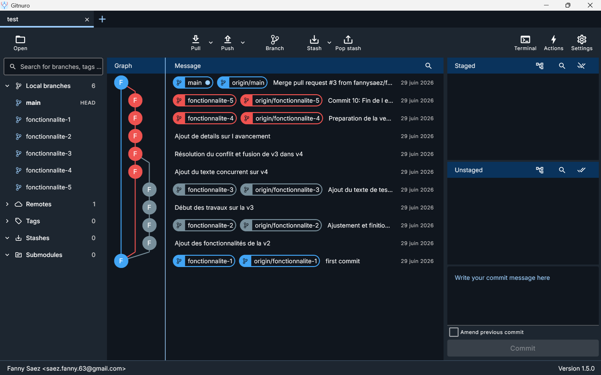

# Entraînement Git — Fanny Saez

Exercice complet de prise en main de Git : branches, commits, conflits de fusion et Pull Requests sur GitHub.  
Réalisé le 29 juin 2026 dans le cadre de la formation **Simplon CDA — Clermont-Ferrand**.

---

## Sessions de formation

| # | Session | Contenu |
|---|---|---|
| 01 | [Introduction & Vue d'ensemble](assets/git-formation/01-introduction.md) | Présentation du dépôt, Gitnuro, schéma des branches |
| 02 | [Initialisation du dépôt](assets/git-formation/02-initialisation.md) | `git init`, `git add`, `git commit`, `git push` |
| 03 | [Branches fonctionnalite-1 et 2](assets/git-formation/03-branche-1-et-2.md) | `git checkout -b`, premiers commits, `git status` |
| 04 | [Branche fonctionnalite-3](assets/git-formation/04-branche-3.md) | Commits enchaînés, `git log`, `git branch` |
| 05 | [Conflit de fusion](assets/git-formation/05-conflit.md) | `git merge`, résolution de conflit, `git diff` |
| 06 | [Finalisation & Pull Request](assets/git-formation/06-finalisation.md) | `fonctionnalite-5`, PR GitHub, `git pull`, `git fetch` |
| 07 | [Récapitulatif & Lexique](assets/git-formation/07-recapitulatif.md) | Tableau de toutes les commandes + lexique complet |
| 08 | [Évolution du README par branche](assets/git-formation/08-evolution-readme.md) | Contenu du fichier à chaque étape de l'exercice |

---

## Structure du projet

```
test/
├── assets/
│   ├── git-formation/
│   │   ├── 01-introduction.md
│   │   ├── 02-initialisation.md
│   │   ├── 03-branche-1-et-2.md
│   │   ├── 04-branche-3.md
│   │   ├── 05-conflit.md
│   │   ├── 06-finalisation.md
│   │   ├── 07-recapitulatif.md
│   │   └── 08-evolution-readme.md
│   └── img/
│       └── gitNuro/
│           └── gitNuro.png
└── README.md
```

---

## Aperçu de l'historique



---

*Documentation réalisée à partir du reflog et de l'historique complet du dépôt.*

---

<p align="center">
  <a href="assets/git-formation/01-introduction.md"></a>
</p>
