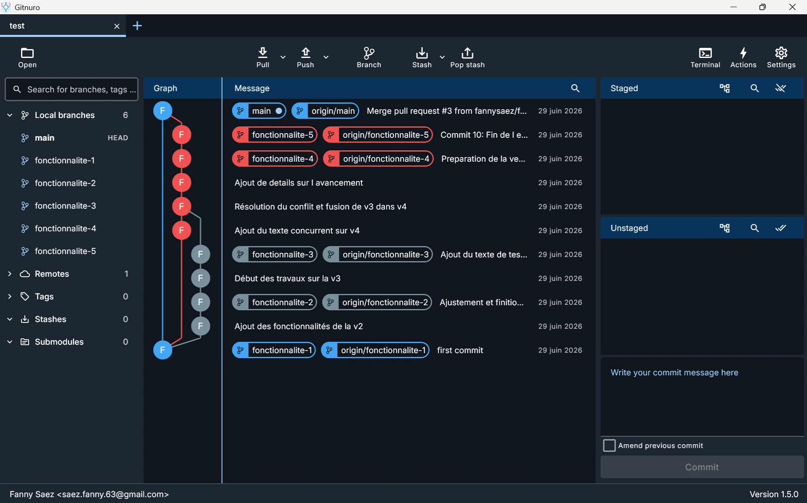

# 01 — Introduction & Vue d'ensemble

## Ce dépôt

Exercice d'entraînement Git complet réalisé le **29 juin 2026** par **Fanny Saez**.  
Il couvre les notions essentielles : création de branches, commits successifs, gestion d'un conflit de fusion, et Pull Requests sur GitHub.

| Élément | Détail |
|---|---|
| Dépôt GitHub | https://github.com/fannysaez/test |
| Branches créées | `main`, `fonctionnalite-1` à `fonctionnalite-5` |
| Nombre de commits | 11 (dont 1 merge commit) |
| Conflit résolu | 1 conflit entre `fonctionnalite-3` et `fonctionnalite-4` |
| Pull Requests | 3 PR fusionnées sur GitHub |

---

## Gitnuro — Interface visuelle Git

**Gitnuro** est un client Git graphique open source, léger et multiplateforme (Windows, macOS, Linux).  
Il permet de visualiser l'historique des commits, gérer les branches, stager des fichiers et effectuer des pushs/pulls — sans taper de commandes dans un terminal.



| Zone | Description |
|---|---|
| **Panneau gauche** | Liste des branches locales (6 au total : `main` + `fonctionnalite-1` à `5`) et le dépôt distant `origin` |
| **Colonne Graph** | Représentation visuelle de l'arbre des commits — divergence et convergence des branches |
| **Colonne Message** | Nom du commit, branches associées (local + `origin/`) et date |
| **Panneau droit** | Zone de staging — fichiers modifiés prêts à être commités |
| **Barre du haut** | Actions rapides : `Pull`, `Push`, `Branch`, `Stash`, `Pop stash`, `Terminal` |

> **Pourquoi utiliser Gitnuro ?**  
> Il est particulièrement utile pour visualiser les conflits, comprendre la structure des branches, et effectuer des opérations Git sans mémoriser toutes les commandes. Idéal en apprentissage.

---

## Schéma des branches

```
main          ●─────────────────────────────────────────────────●  (Merge PR #3)
               \                                                /
fonctionnalite-5 \                                             ● Commit 10 : Fin de l'entraînement
fonctionnalite-4  ●──●──M──●──●                               (M = merge de fonctionnalite-3)
                  ↑  ↑  ↑
fonctionnalite-3  │  │  └──●──●  (v3 : 2 commits)
fonctionnalite-2  │  └──●──●    (v2 : 2 commits)
fonctionnalite-1  └── (branche vide, sert de point de départ)
```

---

<p align="center">
  <a href="../../README.md"></a> &nbsp;&nbsp; <a href="02-initialisation.md"></a>
</p>
